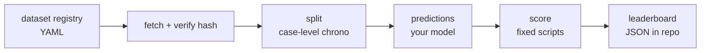

<div align="center">

# `pm-bench`

### the open process-mining benchmark

**Datasets. Splits. Scoring. Leaderboard. Companion to `gnn`.**

[](./LICENSE)
[](#roadmap)
[](#install)

</div>

A reproducible benchmark suite for process mining. Curated event-log
datasets (BPI Challenge 2012/2017/2018/2019/2020, Sepsis, RoadTraffic,
Helpdesk), standard case-level splits, fixed scoring scripts for
next-event prediction, remaining-time prediction, conformance, and
bottleneck detection. Plus a leaderboard.

> **The thesis.** Every process-mining paper invents its own split, its
> own metric, its own preprocessing. Comparison is impossible. The field
> has had a "MNIST moment" coming for a decade. `pm-bench` is the
> opinionated default: same splits, same metrics, same leakage rules, every time.

---

## ✦ Tasks

| Task | Metric | Notes |
|---|---|---|
| Next-event prediction | top-1 / top-3 accuracy | suffix-aware, no leakage |
| Remaining-time prediction | MAE in days | weighted by case length |
| Outcome prediction | AUC | binary outcome from log metadata |
| Conformance checking | F-score | discovered model vs held-out cases |
| Bottleneck detection | NDCG@10 | rank transitions by held-out wait time |

## ✦ Usage

```bash
pip install pm-bench
pm-bench list                                     # available datasets
pm-bench fetch bpi2020                            # download + cache
pm-bench split bpi2020 --task next-event          # train/val/test
pm-bench score predictions.csv --task next-event --dataset bpi2020
pm-bench leaderboard --task next-event            # current standings
```

## ✦ Splits

Case-level chronological. Train = oldest 70% of cases by start time, val
= next 10%, test = newest 20%. No within-case leakage. Suffix-aware: for
prefix-of-length-`k` evaluation, prefixes are sampled from test cases only.

## ✦ Datasets

| Name | Cases | Events | Source |
|---|---|---|---|
| `bpi2012` | 13,087 | 262,200 | 4TU.ResearchData |
| `bpi2017` | 31,509 | 1,202,267 | 4TU.ResearchData |
| `bpi2018` | 43,809 | 2,514,266 | 4TU.ResearchData |
| `bpi2019` | 251,734 | 1,595,923 | 4TU.ResearchData |
| `bpi2020` | 10,500 | 76,000 | 4TU.ResearchData |
| `sepsis` | 1,050 | 15,214 | 4TU.ResearchData |
| `helpdesk` | 4,580 | 21,348 | doi.org/10.17632 |

All public, all redistributable, all hashed.

## ✦ How



## ✦ Leaderboard

Submit a PR adding a row to `leaderboard/<task>/<dataset>.json`. CI
re-runs the scoring script against your linked predictions file. No
hand-edited numbers.

## ✦ Roadmap

- [ ] v0.1 — fetch + cache + hash for all 7 datasets
- [ ] v0.2 — splits: next-event, remaining-time
- [ ] v0.3 — scoring scripts for all 5 tasks
- [ ] v0.4 — leaderboard CI + landing page
- [ ] v0.5 — baselines: `gnn`, transformer, LSTM, Markov
- [ ] v1.0 — first external submissions

## ✦ License

MIT for code. Datasets carry their original licenses (linked in registry).
