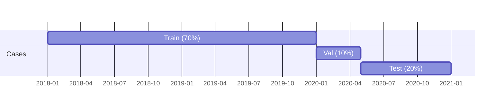
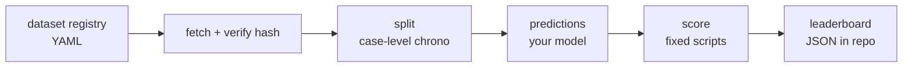

<div align="center">

# `pm-bench`

### the open process-mining benchmark

**Datasets. Splits. Scoring. Leaderboard. Companion to `gnn`.**

[](./LICENSE)
[](#roadmap)
[](#install)

</div>

A reproducible benchmark suite for process mining. Curated event-log
datasets - BPI Challenge 2012 / 2017 / 2018 / 2019 / 2020, Sepsis,
Helpdesk - plus standard case-level splits, fixed scoring scripts for
next-event prediction / remaining-time / outcome / conformance /
bottleneck detection, and a CI-driven leaderboard.

> **The thesis.** Every process-mining paper invents its own split,
> its own metric, its own preprocessing. Comparison is impossible. The
> field has had a "MNIST moment" coming for a decade. `pm-bench` is the
> opinionated default - same splits, same metrics, same leakage rules,
> every time.

---

## ✦ Why this exists

If you read three random next-event prediction papers from the last five
years, you will find:

- **Three different ways to split** - random, chronological, prefix-based,
  case-level, event-level. Most don't disclose; many leak.
- **Three different definitions of "accuracy"** - top-1 over events,
  top-1 over cases, weighted by case length, perplexity in disguise.
- **Three different preprocessings** - different time encodings,
  different scaling, different handling of rare activities.

The result: a paper claims SOTA at 88% top-1, but the prior method
reported 84% - on a different split, with a different metric, with a
different leakage profile. There's no signal in the comparison.

`pm-bench` fixes the splits, fixes the metrics, fixes the preprocessing.
You either run on `pm-bench` or you don't claim to have advanced the
state of the art.

## ✦ Tasks

| Task | Metric | What you predict |
|---|---|---|
| Next-event prediction | top-1 / top-3 accuracy | Activity at position `k+1` given prefix of length `k` |
| Remaining-time prediction | MAE in days, weighted by case length | Time from now to case completion |
| Outcome prediction | AUC | Binary outcome (e.g., "loan approved" / "case escalated") |
| Conformance checking | F-score (fitness × precision) | How well a discovered model fits held-out cases |
| Bottleneck detection | NDCG@10 | Rank of transitions by held-out wait time |

All five tasks share the same splits - so a model that does well on
next-event isn't free-riding on a more permissive split for outcome
prediction.

## ✦ Splits

**Case-level chronological.** Train = oldest 70% of cases by start
time, val = next 10%, test = newest 20%. No within-case leakage.
Suffix-aware: for prefix-of-length-`k` evaluation, prefixes are sampled
with replacement from test cases only - never train.



This is stricter than the field default (which often uses random
case-level splits, leaking time signal). It will produce numbers a
couple points worse than the literature; that's the point.

## ✦ Datasets

| Name | Cases | Events | Source | License |
|---|---|---|---|---|
| `bpi2012` | 13,087 | 262,200 | [4TU.ResearchData](https://data.4tu.nl) | CC BY 4.0 |
| `bpi2017` | 31,509 | 1,202,267 | 4TU.ResearchData | CC BY 4.0 |
| `bpi2018` | 43,809 | 2,514,266 | 4TU.ResearchData | CC BY 4.0 |
| `bpi2019` | 251,734 | 1,595,923 | 4TU.ResearchData | CC BY 4.0 |
| `bpi2020` | 10,500 | 76,000 | 4TU.ResearchData | CC BY 4.0 |
| `sepsis` | 1,050 | 15,214 | 4TU.ResearchData | CC BY 4.0 |
| `helpdesk` | 4,580 | 21,348 | [Mendeley Data](https://doi.org/10.17632) | CC BY 4.0 |

All public, all redistributable, all hashed. The benchmark verifies the
hash before scoring - if you've subtly modified the file, you'll know.

We don't host the datasets ourselves; we fetch from the canonical URLs
and cache locally. Datasets carry their original licenses (linked in
`datasets/registry.yml`).

## ✦ Install & use

```bash
pip install pm-bench

pm-bench list                                                # available datasets
pm-bench split synthetic-toy > split.json                    # train/val/test case ids
pm-bench prefixes synthetic-toy \
  --split split.json --out prefixes.csv                      # prediction targets
pm-bench predict synthetic-toy \
  --split split.json --prefixes prefixes.csv \
  --out predictions.csv --baseline markov                    # reference baseline
pm-bench score predictions.csv \
  --prefixes prefixes.csv --task next-event                  # top-1 / top-3
```

The full loop (`split → prefixes → predict → score`) runs end-to-end on
`synthetic-toy` today; it's covered by `tests/test_e2e.py` and locks
the file formats the leaderboard depends on.

**Inspect any log.** `pm-bench stats <name-or-path>` prints n_cases /
n_events / activity-distribution / top transitions in one shot.

**Bring your own CSV.** Any path-like argument is loaded as an event
log directly, no registry plumbing needed:

```bash
pm-bench split path/to/log.csv > split.json
pm-bench prefixes path/to/log.csv --split split.json --out prefixes.csv
# ... rest of the loop is the same
```

CSVs need columns mappable to `case_id`, `activity`, `timestamp` -
both pm-bench-native names and PM4Py XES-derived names
(`case:concept:name`, `concept:name`, `time:timestamp`) work.
`.csv.gz` is auto-detected.

For the public datasets, the fetch + hash machinery is in place:

```bash
pm-bench fetch bpi2020                    # auto-downloads if URL is set
pm-bench fetch bpi2020 --pin              # after manual TOS-gated download,
                                          # emits a registry.yml sha256 patch
```

`pm-bench fetch` resolves a cache directory (`$PM_BENCH_CACHE`, else
`~/.cache/pm-bench/`), verifies the registry sha256 if pinned, and -
for TOS-gated 4TU / Mendeley datasets - prints the precise landing URL
and on-disk path you need to fill in. The per-dataset hash pins are the
last manual step before BPI / Sepsis / Helpdesk run through the same
loop as `synthetic-toy`.

The full pipeline:



**Variance experiments.** Use `synthetic-toy@<seed>` (e.g.
`synthetic-toy@99`) to run the generator at a non-canonical seed
without losing reproducibility — bare `synthetic-toy` always means
seed=42 for the leaderboard.

## ✦ Baseline variance

Reference numbers in [STANDINGS.md](./STANDINGS.md) are computed at a
single canonical seed (`seed=42`). To see how much performance jitters
across data draws, run:

```bash
python -m bench.seeds --n 30
```

Emits a markdown table of mean / std / min / max per metric across N
seeds — the noise band any submission has to clear before a claim of
"better than the baseline" is statistically interesting.

## ✦ Current standings

Live numbers per (task, dataset) - auto-generated and verified in CI:
[STANDINGS.md](./STANDINGS.md). Regenerate locally with
`pm-bench leaderboard --all --markdown > STANDINGS.md`.

## ✦ Submitting to the leaderboard

See [CONTRIBUTING.md](./CONTRIBUTING.md) for the full walkthrough — file
formats, the score command per task, the verify-before-PR step, and the
noise-quantification recommendation.

The short version:

Open a PR adding a row to `leaderboard/<task>/<dataset>.json`:

```json
{
  "model": "my-cool-transformer",
  "version": "0.4.1",
  "paper": "https://arxiv.org/abs/...",
  "code": "https://github.com/...",
  "predictions_url": "https://...predictions.csv.gz",
  "score": null,
  "scored_at": null
}
```

CI fetches the predictions, re-runs the scoring script, fills in `score`
and `scored_at`. No hand-edited numbers. If your URL goes 404, your
entry is removed.

## ✦ Comparison: `pm-bench` vs ad-hoc evaluation

| | Ad-hoc | `pm-bench` |
|---|---|---|
| Split methodology | Varies, often random | Fixed: case-level chrono |
| Leakage detection | Manual / none | Built-in (suffix-aware) |
| Metric definition | Per-paper | Documented per-task |
| Preprocessing | Hidden in code | Provided as a script |
| Reproducibility | "code on request" | One command |
| Comparable across years | No | Yes |

## ✦ FAQ

**Q: Why these splits?**
A: Case-level chronological is the only split that mirrors deployment.
You train on the past, you predict the future. Any other split leaks.

**Q: Why these tasks?**
A: They're the questions process owners actually ask. We lifted them
from the operational checklist `gnn` already documents.

**Q: Can I add a new dataset?**
A: PR. Add a `registry.yml` entry with URL + hash + license. CI verifies
it's reachable and hashes match.

**Q: What about the "Road Traffic Fine Management" dataset?**
A: Coming in v0.2. The current 7 are the most-cited.

**Q: Why not host the datasets ourselves?**
A: Legal complexity, and the original hosts are stable. We fetch on
demand.

**Q: Why is my number lower on `pm-bench` than in my paper?**
A: Because your paper's split probably leaked. That's the cost of
honesty. The point of the benchmark is to make the comparison real.

## ✦ Non-goals

- Hosting the datasets ourselves
- Inventing new tasks; we curate, we don't speculate
- Becoming a model zoo (that's [`gnn`](https://github.com/erphq/gnn))
- Streaming / online evaluation
- Multi-perspective conformance (resource, data attributes)

## ✦ Roadmap

- [x] v0.0 - scaffold, dataset registry, split design
- [x] v0.0.1 - end-to-end loop on `synthetic-toy`: split → prefixes →
      predict (Markov) → score, with a smoke test that locks the file
      formats
- [🟡] v0.1 - fetch + cache + hash for all 7 datasets. Machinery
      shipped (`pm-bench fetch <name> [--pin]`, sha256 verification,
      `$PM_BENCH_CACHE` resolution); per-dataset hash-pinning PRs
      pending the one-time TOS-gated downloads from 4TU and Mendeley.
- [x] v0.2 - splits + targets for next-event ✅ and remaining-time ✅
- [x] v0.3 - scoring scripts for all 5 tasks ✅. next-event,
      remaining-time, outcome, bottleneck, conformance - every task
      ships with a CPython baseline and a real leaderboard entry on
      synthetic-toy. All five entries are verified by
      `pm-bench leaderboard --all --verify` in CI.
- [x] v0.4 - leaderboard CI + landing page. Standings JSON,
      reference entries, `pm-bench leaderboard [--all] [--verify]
      [--markdown]`, the dedicated `leaderboard.yml` GitHub workflow,
      and an auto-generated [STANDINGS.md](./STANDINGS.md) all
      shipped; CI fails if the checked-in STANDINGS.md drifts.
- [ ] v0.5 - baselines: `gnn`, transformer, LSTM, Markov ✅ (Markov shipped)
- [ ] v1.0 - first external submissions; cited in ≥1 paper

## ✦ Topics

`process-mining` · `benchmark` · `machine-learning` · `event-logs` ·
`bpi-challenge` · `leaderboard` · `conformance-checking` ·
`predictive-process-monitoring` · `datasets` · `python` · `pm4py`

## ✦ License

MIT for code. Datasets carry their original licenses (linked in
`datasets/registry.yml`).
